# Database ERD

> Year-specific voting tables (`hl1993s`, `hl2024h1`, etc.) share the same schema as `hl_hlasovani` and are omitted for clarity.
> Note: `druh_tisku`, `typ_zakon`, `typ_stavu`, `stavy`, `prechody`, `typ_akce` are incorrectly aliased to the `tisky` schema by the ETL — their logical structure is shown here.

```mermaid
erDiagram

    %% ── PEOPLE & ORGANIZATION ──────────────────────────────────────────────

    osoby {
        int  id_osoba   PK
        text jmeno
        text prijmeni
        text narozeni
        text pohlavl
        text zmena
        text umrti
    }

    poslanec {
        int id_poslanec PK
        int id_osoba    FK
        int id_kraj
        int id_kandidatka
        int id_period
        int web
        int ulice
        int obec
        int psc
        int email
        int telefon
        int fax
        int psp_telefon
        int facebook
        int foto
    }

    pkgps {
        int   id_poslanec PK "FK → poslanec"
        float lat
        float lng
    }

    organy {
        int  id_organ         PK
        int  id_typ_organu    FK
        int  organ_id_organ
        text zkratka
        text nazev_organu_cz
        text nazev_organu_en
        text od_organ
        text do_organ
        int  priorita
        int  cl_organ_base
    }

    typ_organu {
        int  id_typ_org      PK
        int  typ_id_typ_org
        text nazev_typ_org_cz
        text nazev_typ_org_en
        int  typ_org_obecny
        int  priorita
    }

    funkce {
        int id_funkce     PK
        int id_organ      FK
        int id_typ_funkce FK
        text nazev_funkce_m
        text nazev_funkce_f
        int  priorita
    }

    typ_funkce {
        int  id_typ_funkce PK
        text typ_funkce_nazev
        int  priorita
    }

    zarazeni {
        int  id_osoba FK
        int  id_of    FK "→ organy"
        text od_o     PK
        text do_o
        int  cl_funkce
        text od_f
        text do_f
    }

    osoba_extra {
        int  id_osoba  FK
        int  id_org    FK "→ organy"
        text typ       PK
        text id_external
        text nazev
        text url
    }

    %% ── VOTING ──────────────────────────────────────────────────────────────

    hl_hlasovani {
        int  id_hlasovani PK
        int  id_organ     FK
        int  schuze
        int  cislo
        int  bod
        text datum
        text cas
        int  pro
        int  proti
        int  zdrzel
        int  nehlasoval
        int  prihlaseno
        int  kvorum
        text druh_hlasovani
        text vysledek
        text nazev_dlouhy
        text nazev_kratky
    }

    hl_poslanec {
        int  id_poslanec  FK
        int  id_hlasovani FK
        text vysledek
    }

    hl_zposlanec {
        int id_hlasovani FK
        int id_osoba     FK
        int mode
    }

    hl_vazby {
        int id_hlasovani FK
        int id_organ     FK
        int turn
        int typ
    }

    hl_check {
        int id_hlasovani PK "FK"
        int turn
        int mode
        int id_h2
        int id_h3
    }

    zmatecne {
        int id_hlasovani PK "FK"
    }

    omluvy {
        int  id_organ    FK
        int  id_poslanec FK
        text den
        text od
        text do
    }

    %% ── BILLS (TISKY) ───────────────────────────────────────────────────────

    tisky {
        int  id_tisk     PK
        int  id_druh     FK
        int  id_stav     FK
        int  id_org      FK "→ organy"
        int  id_osoba    FK "→ osoby (navrhovatel)"
        text nazev_tisku
        text predlozeno
        text rozeslano
        text t_url
        int  is_eu
        int  status
    }

    druh_tisku {
        int  id_druh_tisku PK
        text nazev
    }

    stavy {
        int  id_stav PK
        text popis
    }

    predkladatel {
        int id_predkladatel PK
        int id_tisk         FK
        int id_osoba        FK
        int poradi
        int typ
    }

    tisky_za {
        int  id_tisk    FK
        int  id_osoba   FK
        int  id_posl    FK "→ poslanec"
        int  cislo_za
        text nazev_za
        int  id_vysledek FK
        int  status
    }

    navrh_podpis {
        int  id_navrh_podpis PK
        int  id_tisk         FK
        int  id_osoba        FK
        int  stav
        text datum
    }

    hist {
        int  id_hist    PK
        int  id_tisk    FK
        text datum
        int  id_hlas
        int  id_prechod FK
        int  id_bod     FK "→ bod_schuze"
        int  schuze
        text poznamka
    }

    hist_vybory {
        int id_hist_vybory PK
        int id_tisku       FK "→ tisky"
        int id_organ       FK
        int id_hist        FK
        int id_posl        FK "→ poslanec"
        int garancni
    }

    vysledek {
        int  id_vysledek  PK
        text druh_vysledek
    }

    prechody {
        int id_prechod PK
        text nazev
    }

    sbirka {
        int  id_sbirka PK
        int  id_tisk   FK
        int  cislo
        int  rok
        text datum
    }

    sb_pre {
        int id_sbirka  FK
        int id_predpis PK
        int id_tisk    FK
        int typ
    }

    %% ── SESSIONS (SCHUZE) ───────────────────────────────────────────────────

    schuze {
        int  id_schuze  PK
        int  id_org     FK "→ organy"
        int  schuze
        text od_schuze
        text do_schuze
        text aktualizace
    }

    bod_schuze {
        int  id_bod      PK
        int  id_schuze   FK
        int  id_tisk     FK
        text uplny_naz
        int  id_bod_stav FK
        int  druh_bodu
    }

    bod_stav {
        int  id_bod_stav PK
        text popis
    }

    schuze_stav {
        int  id_schuze FK
        int  stav
        int  typ
        text text_dt
        text text_st
    }

    %% ── INTERPELLATIONS ─────────────────────────────────────────────────────

    los_interpelaci {
        int  id_interpelace PK
        int  id_los
        text datum_los
        int  id_schuze      FK
        int  id_bod         FK "→ bod_schuze"
        int  id_org         FK "→ organy"
    }

    poradi {
        int  id_poradi    PK
        int  id_losovani  FK "→ los_interpelaci"
        int  id_poslanec  FK
        int  id_ministr
        text vec
        int  priorita
    }

    uitypv {
        int  id_interpelace FK
        int  id_poslanec    FK
        int  id_ui_stav
        text nazev
        int  priorita
    }

    ui_stav {
        int id_ui_stav PK
        int id_poradi  FK
        int id_typ
        int steno
    }

    %% ── STENOGRAPHY / SPEECHES ──────────────────────────────────────────────

    steno {
        int id_steno PK
        int id_org   FK "→ organy"
        int schuze
        int turn
        int od_steno
    }

    steno_bod {
        int id_steno_bod PK
        int id_steno     FK
        int id_bod       FK "→ bod_schuze"
        int aname
    }

    rec {
        int id_rec    PK
        int id_steno  FK
        int id_osoba  FK
        int id_bod    FK "→ bod_schuze"
        int druh
    }

    %% ── RELATIONSHIPS ───────────────────────────────────────────────────────

    %% People
    osoby       ||--o{ poslanec       : "is MP"
    osoby       ||--o| pkgps          : "has location"
    poslanec    ||--o{ zarazeni       : "assigned to"
    zarazeni    }o--|| organy         : "in body"
    funkce      }o--|| organy         : "belongs to"
    funkce      }o--|| typ_funkce     : "categorized by"
    organy      }o--|| typ_organu     : "typed as"
    osoby       ||--o{ osoba_extra    : "extra info"
    osoba_extra }o--|| organy         : "in org"

    %% Voting
    hl_hlasovani }o--|| organy        : "held in"
    hl_poslanec  }o--|| poslanec      : "MP voted"
    hl_poslanec  }o--|| hl_hlasovani  : "in vote"
    hl_zposlanec }o--|| hl_hlasovani  : "substitute in"
    hl_zposlanec }o--|| osoby         : "substituted by"
    hl_vazby     }o--|| hl_hlasovani  : "linked to"
    hl_vazby     }o--|| organy        : "in organ"
    hl_check     }o--|| hl_hlasovani  : "checks"
    zmatecne     }o--|| hl_hlasovani  : "flags"
    omluvy       }o--|| organy        : "from"
    omluvy       }o--|| poslanec      : "excuses"

    %% Bills
    tisky        }o--|| organy        : "submitted to"
    tisky        }o--|| osoby         : "authored by"
    tisky        }o--|| druh_tisku    : "of type"
    tisky        }o--|| stavy         : "has status"
    predkladatel }o--|| tisky         : "submits"
    predkladatel }o--|| osoby         : "submitted by"
    tisky_za     }o--|| tisky         : "version of"
    tisky_za     }o--|| osoby         : "authored by"
    tisky_za     }o--|| vysledek      : "with result"
    navrh_podpis }o--|| tisky         : "signs"
    navrh_podpis }o--|| osoby         : "signed by"
    hist         }o--|| tisky         : "history of"
    hist         }o--|| prechody      : "via transition"
    hist         }o--|| bod_schuze    : "at agenda item"
    hist_vybory  }o--|| hist          : "committee in"
    hist_vybory  }o--|| organy        : "by committee"
    hist_vybory  }o--|| poslanec      : "rapporteur"
    sbirka       }o--|| tisky         : "published as"
    sb_pre       }o--|| sbirka        : "in collection"
    sb_pre       }o--|| tisky         : "references"

    %% Sessions
    schuze       }o--|| organy        : "of body"
    bod_schuze   }o--|| schuze        : "item in"
    bod_schuze   }o--o| tisky         : "discusses"
    bod_schuze   }o--|| bod_stav      : "has status"
    schuze_stav  }o--|| schuze        : "status of"

    %% Interpellations
    los_interpelaci }o--|| schuze     : "drawn in"
    los_interpelaci }o--|| bod_schuze : "at item"
    poradi          }o--|| los_interpelaci : "ordered in"
    poradi          }o--|| poslanec   : "asked by"
    uitypv          }o--|| los_interpelaci : "typed as"
    uitypv          }o--|| poslanec   : "by MP"
    ui_stav         }o--|| poradi     : "status of"

    %% Speeches
    steno       }o--|| organy         : "in body"
    steno_bod   }o--|| steno          : "part of"
    steno_bod   }o--|| bod_schuze     : "for item"
    rec         }o--|| steno          : "in session"
    rec         }o--|| osoby          : "spoken by"
    rec         }o--|| bod_schuze     : "about item"
```

